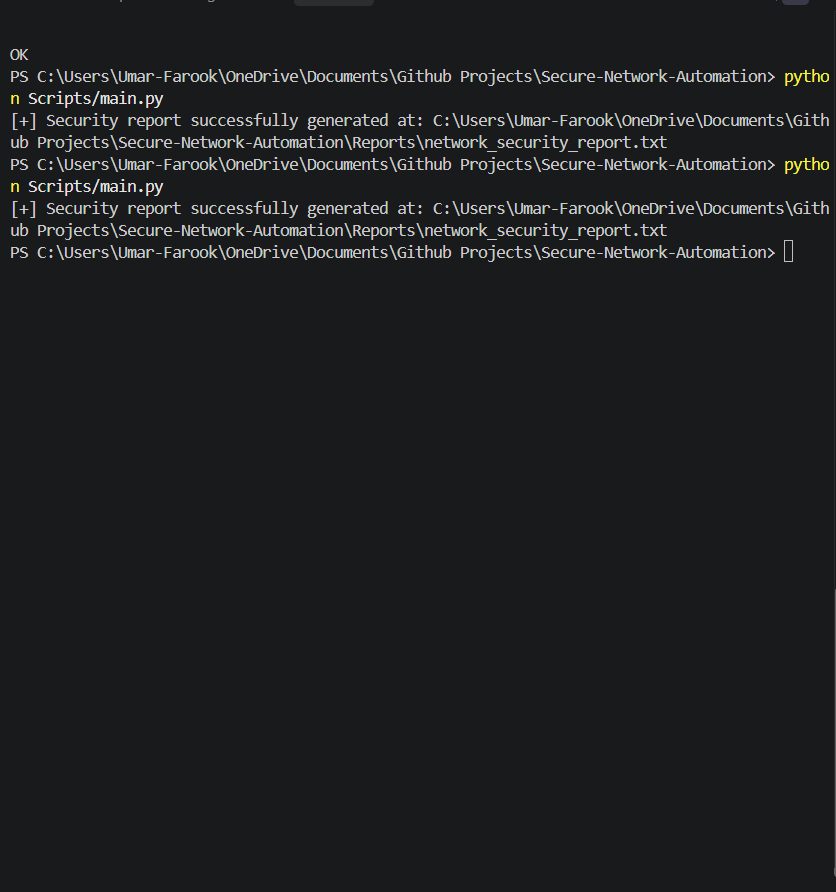

Exactly. For GitHub, **more information does not automatically make the README more professional**. It should be detailed enough to explain the project, but not so long that a recruiter has to scroll through unnecessary sections.

I'll keep it close to the amount of information you originally provided, but make the wording, formatting, and presentation more professional.

Use this as your `README.md`:

````markdown
# 🔐 Secure Network Automation & Configuration Validation Platform



## Overview

The **Secure Network Automation & Configuration Validation Platform** is a Python-based enterprise security automation framework designed to audit and validate network device configurations against centralized security policies.

Using a **Policy-as-Code** approach, the platform evaluates router, switch, and firewall configurations, identifies security violations, calculates compliance status, and generates automated audit reports.

## Key Features

- **Policy-as-Code Engine:** Evaluates device configurations against centralized JSON security policies.
- **Automated Compliance Scoring:** Calculates security posture and identifies high, medium, and low severity findings.
- **Device Inventory Management:** Uses structured CSV inventory data and configuration files to manage multiple network devices.
- **Automated Audit Reporting:** Generates persistent compliance reports containing device findings and security statistics.
- **Automated Testing:** Includes a built-in `unittest` suite for validating security validation logic.

## Project Directory Structure

```text
Secure-Network-Automation/
│
├── Assets/
│   ├── .gitkeep
│   └── Terminal_output.png
│
├── Backups/
│   ├── .gitkeep
│   └── EDGE-RTR-02_backup.txt
│
├── Data/
│   ├── Configs/
│   │   ├── CORE-SW-02.txt
│   │   ├── DMZ-FW-02.txt
│   │   └── EDGE-RTR-02.txt
│   └── devices.csv
│
├── Policies/
│   └── network_security_policy.json
│
├── Reports/
│   └── network_security_report.txt
│
├── Scripts/
│   └── main.py
│
├── Tests/
│   └── test_validator.py
│
└── README.md
```

## Security Policy Controls

The platform validates configurations against security controls defined in `Policies/network_security_policy.json`.

| Severity | Security Control | Validation |
|---|---|---|
| 🔴 HIGH | SSH Version | Requires SSH Version 2 |
| 🔴 HIGH | Telnet | Detects insecure cleartext management |
| 🟠 MEDIUM | HTTP Server | Detects enabled HTTP management |
| 🟢 LOW | Password Encryption | Checks `service password-encryption` |
| 🟢 LOW | MOTD Banner | Validates required security banner |

## Installation & Setup

### 1. Clone the Repository

```bash
git clone https://github.com/Umar-Farooq-Shaikh/Secure-Network-Automation.git
cd Secure-Network-Automation
```

### 2. Verify Environment

Ensure **Python 3.10+** is installed.

```bash
python --version
```

## Usage

Run the security validation pipeline from the project root:

```bash
python Scripts/main.py
```

Run the automated test suite:

```bash
python -m unittest discover -s Tests
```

## Output & Reporting

After execution, the platform displays the validation results in the terminal and generates the following report:

```text
Reports/network_security_report.txt
```

The report contains:

- Per-device security findings
- Severity classifications
- Compliance status
- Security scores
- Audit summary statistics

## Project Workflow

```text
Device Inventory
       ↓
Configuration Files
       ↓
Security Policy
       ↓
Configuration Validation
       ↓
Risk Classification
       ↓
Compliance Score
       ↓
Audit Report
```

## Security Considerations

- Uses Python's standard library without third-party dependencies.
- Separates security policies from application logic.
- Treats configuration files as untrusted input.
- Avoids storing device credentials in the project.
- Supports configuration backup for audit and historical reference.

## Future Enhancements

- Configuration drift detection
- Real device SSH integration
- Multi-vendor device support
- Automated remediation suggestions
- SIEM integration
- Expanded security policy controls

## Technology Stack

| Technology | Purpose |
|---|---|
| Python 3.10+ | Automation engine |
| CSV | Device inventory |
| JSON | Security policies |
| `unittest` | Automated testing |
| Git | Version control |
| GitHub | Project hosting |

## Portfolio Value

This project demonstrates practical skills in:

**Network Security • Python Automation • Configuration Management • Policy-as-Code • Risk Assessment • Compliance • Security Reporting**

---

**Secure Network Automation — Automating network security validation through policy-driven configuration analysis.**
````
